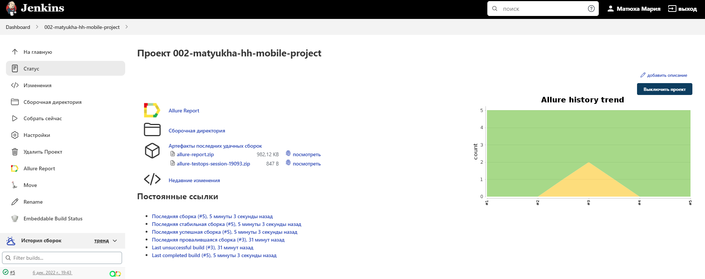
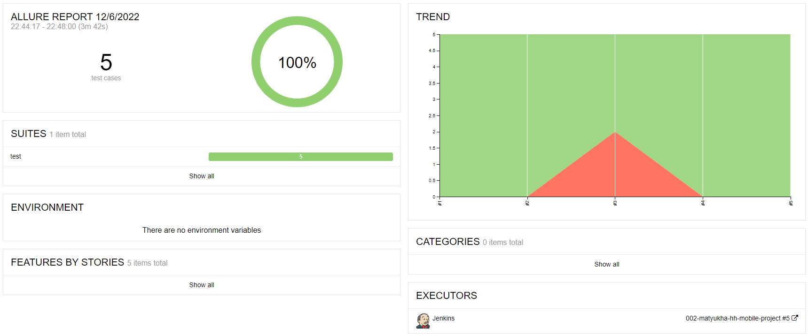

# Проект по тестированию мобильного приложения [hh](https://hh.ru/)

  

## В проекте используются следующие технологии и инструменты:

## Сборка в [Jenkins](https://jenkins.autotests.cloud/job/002-matyukha-hh-mobile-project/)

  

## Информация о тестах в [Allure report](https://jenkins.autotests.cloud/job/002-matyukha-hh-mobile-project/5/allure/)

### Главное окно

  

### Окно с кейсами

  

## Интеграция с [AllureTestOps](https://allure.autotests.cloud/project/1737/dashboards)

### Тест-кейсы

  

### Дашборд

  

## Уведомление в Telegram

  

<
